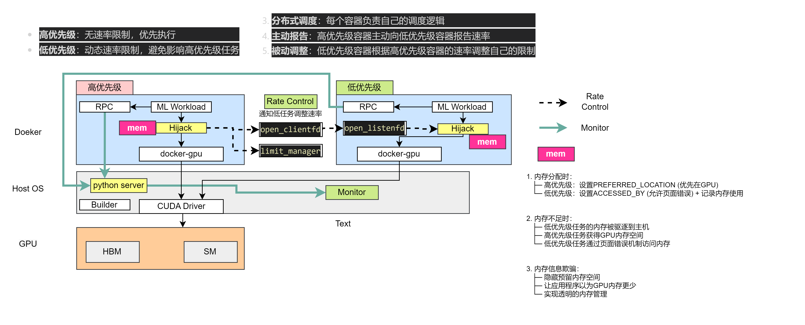

# TGS

Haibin:

1. 要安装CMake 和 make
2. 安装 nvidia-container-toolkit

3. 要给docker权限
```
sudo usermod -aG docker cc
newgrp docker
```

4. python不要太新，我用3.10能跑通，最好用conda新建环境

5. 小心脚本会删除所有其他的容器


## 框架解读





## 1. Introduction

This repository contains one version of the source code for our NSDI'23 paper "Transparent GPU Sharing in Container Clouds for Deep Learning Workloads" [[Paper]](https://www.usenix.org/conference/nsdi23/presentation/wu)

## 2. Environment requirement

Please see `requirement.txt` and [paper](https://www.usenix.org/conference/nsdi23/presentation/wu) for more details.

## 3. Prerequisites

Run the following commands:

```bash
sudo apt install patchelf wget unzip make
pip3 install -r requirement.txt
docker pull bingyangwu2000/tf_torch
docker pull bingyangwu2000/pytorch_with_unified_memory
docker pull bingyangwu2000/antman
docker pull bingyangwu2000/espnet2
```

## 4. Build

Run the following commands

```bash
git clone --recursive https://github.com/BingyangWu/TGS.git
cd TGS
make rpc
./download.sh
cd hijack
./build.sh
```

## 4. Run example

TGS: 

```
./scripts/test_tgs.sh
```

Co-execution:

```
./scripts/test_co_ex.sh
```

MPS:

```
./scripts/test_mps.sh
```

AntMan:

```
./script/test_antman.sh
```

MIG:

```
./script/test_mig.sh
```

When run experiments in `Figure 5`, please use image `bingyangwu2000/pytorch_with_unified_memory` for Co-execution, MPS and MIG.

When run experiments in `Figure 9(a)`, please use image `bingyangwu2000/espnet2`. 

When run experiments in `Figure 12`, please use image `goldensea/megatron:v2`.