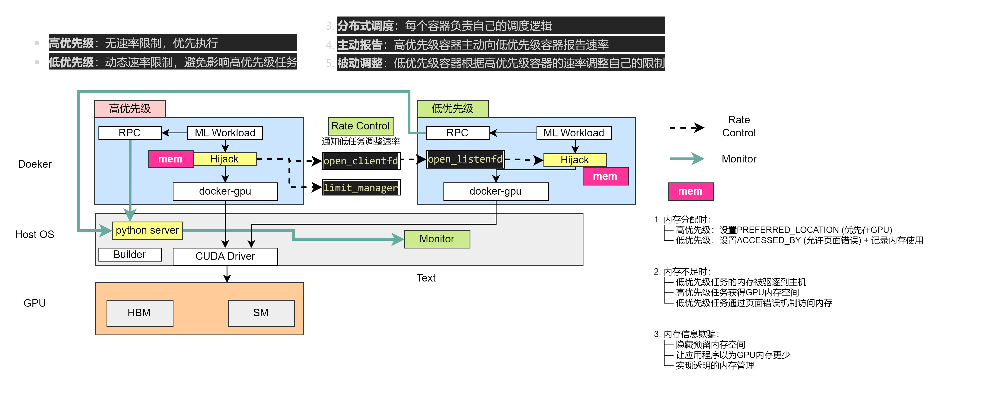

# TGS

Haibin:

1. 要安装CMake 和 make
2. 安装 nvidia-container-toolkit

3. 要给docker权限
```
sudo usermod -aG docker cc
newgrp docker
```

4. python不要太新，我用3.10能跑通，最好用conda新建环境

5. 小心脚本会删除所有其他的容器


## 框架解读





## 1. Introduction

This repository contains one version of the source code for our NSDI'23 paper "Transparent GPU Sharing in Container Clouds for Deep Learning Workloads" [[Paper]](https://www.usenix.org/conference/nsdi23/presentation/wu)

## 2. Environment requirement

Please see `requirement.txt` and [paper](https://www.usenix.org/conference/nsdi23/presentation/wu) for more details.

## 3. Prerequisites

Run the following commands:

```bash
sudo apt install patchelf wget unzip make
pip3 install -r requirement.txt
docker pull bingyangwu2000/tf_torch
docker pull bingyangwu2000/pytorch_with_unified_memory
docker pull bingyangwu2000/antman
docker pull bingyangwu2000/espnet2
```

## 4. Build

Run the following commands

```bash
git clone --recursive https://github.com/BingyangWu/TGS.git
cd TGS
make rpc
./download.sh
cd hijack
./build.sh
```

## 4. Run example

TGS: 

```
./scripts/test_tgs.sh
```

Co-execution:

```
./scripts/test_co_ex.sh
```

MPS:

```
./scripts/test_mps.sh
```

AntMan:

```
./script/test_antman.sh
```

MIG:

```
./script/test_mig.sh
```

When run experiments in `Figure 5`, please use image `bingyangwu2000/pytorch_with_unified_memory` for Co-execution, MPS and MIG.

When run experiments in `Figure 9(a)`, please use image `bingyangwu2000/espnet2`. 

When run experiments in `Figure 12`, please use image `goldensea/megatron:v2`.


## Profile

profile的commint会将通信运行时间存储在job2的 `tmp/cudalog`，将通信的限制速度存储在job1的 `/tmp/cudalog`。

要想看清使用
```
docker ps
# sudo docker exec -it fb0c7498a90c /bin/bash
sudo docker exec -it <docker id> /bin/bash
```

Or you can use `scripts/download_logs.sh`

```
bash scripts/download_logs.sh
```

And you may see:

```
[INFO] Copying from job_2 (6f7520dd87cf): /tmp/cudalog -> ./cuda_logs/job_2-20251112_173142
[OK]   Saved to: ./cuda_logs/job_2-20251112_173142
[INFO] Copying from job_1 (25f387cff8aa): /tmp/cudalog -> ./cuda_logs/job_1-20251112_173142
[OK]   Saved to: ./cuda_logs/job_1-20251112_173142
```


### copy data

```txt
# 假设 docker id 是 fb0c7498a90c
docker cp fb0c7498a90c:/tmp/cudalog ./cudalog
```


Low speed workload log examples:

```
/home/haibin/cxsj_25fall/TGS-GPU-kernel/hijack/src/low_priority_hijack_call.c:538 [0] recv_rate: 388665912.00, max_rate: 391528092.00, rate_limit: 502579

/home/haibin/cxsj_25fall/TGS-GPU-kernel/hijack/src/low_priority_hijack_call.c:540 [0] kernel monitor: current_rate = 408674, current_kernel_count = 336

/home/haibin/cxsj_25fall/TGS-GPU-kernel/hijack/src/low_priority_hijack_call.c:538 [0] recv_rate: 388895328.00, max_rate: 391528092.00, rate_limit: 600461

/home/haibin/cxsj_25fall/TGS-GPU-kernel/hijack/src/low_priority_hijack_call.c:540 [0] kernel monitor: current_rate = 503115, current_kernel_count = 738

/home/haibin/cxsj_25fall/TGS-GPU-kernel/hijack/src/low_priority_hijack_call.c:538 [0] recv_rate: 386571679.00, max_rate: 391528092.00, rate_limit: 698343

/home/haibin/cxsj_25fall/TGS-GPU-kernel/hijack/src/low_priority_hijack_call.c:540 [0] kernel monitor: current_rate = 601261, current_kernel_count = 833

/home/haibin/cxsj_25fall/TGS-GPU-kernel/hijack/src/low_priority_hijack_call.c:538 [0] recv_rate: 386010390.00, max_rate: 391528092.00, rate_limit: 796225

/home/haibin/cxsj_25fall/TGS-GPU-kernel/hijack/src/low_priority_hijack_call.c:540 [0] kernel monitor: current_rate = 701309, current_kernel_count = 578
```

You can see `current_kernel_count`, which is the number of kernel launching every 5s. And you can also see `recv_rate`, this is counted by every kernel's `gridDimX * gridDimY * gridDimZ` (compute resource count).


High speed workload log examples:

```
/home/haibin/cxsj_25fall/TGS-GPU-kernel/hijack/src/high_priority_hijack_call.c:337 387334547.000000

/home/haibin/cxsj_25fall/TGS-GPU-kernel/hijack/src/high_priority_hijack_call.c:302 [0] rate_watcher start @3333

/home/haibin/cxsj_25fall/TGS-GPU-kernel/hijack/src/high_priority_hijack_call.c:194 [0] rate_monitor: current_rate = 387888320, current_kernel_count = 363265

/home/haibin/cxsj_25fall/TGS-GPU-kernel/hijack/src/high_priority_hijack_call.c:331 通信耗时 CPU cycles: 10974442710

/home/haibin/cxsj_25fall/TGS-GPU-kernel/hijack/src/high_priority_hijack_call.c:335 通信耗时: 5.000077 秒

/home/haibin/cxsj_25fall/TGS-GPU-kernel/hijack/src/high_priority_hijack_call.c:337 387888320.000000

/home/haibin/cxsj_25fall/TGS-GPU-kernel/hijack/src/high_priority_hijack_call.c:302 [0] rate_watcher start @3333

/home/haibin/cxsj_25fall/TGS-GPU-kernel/hijack/src/high_priority_hijack_call.c:194 [0] rate_monitor: current_rate = 388602202, current_kernel_count = 363957

/home/haibin/cxsj_25fall/TGS-GPU-kernel/hijack/src/high_priority_hijack_call.c:331 通信耗时 CPU cycles: 10974445258

/home/haibin/cxsj_25fall/TGS-GPU-kernel/hijack/src/high_priority_hijack_call.c:335 通信耗时: 5.000078 秒

/home/haibin/cxsj_25fall/TGS-GPU-kernel/hijack/src/high_priority_hijack_call.c:337 388602202.000000

/home/haibin/cxsj_25fall/TGS-GPU-kernel/hijack/src/high_priority_hijack_call.c:302 [0] rate_watcher start @3333

/home/haibin/cxsj_25fall/TGS-GPU-kernel/hijack/src/high_priority_hijack_call.c:194 [0] rate_monitor: current_rate = 391227298, current_kernel_count = 366320

/home/haibin/cxsj_25fall/TGS-GPU-kernel/hijack/src/high_priority_hijack_call.c:331 通信耗时 CPU cycles: 10974454162

/home/haibin/cxsj_25fall/TGS-GPU-kernel/hijack/src/high_priority_hijack_call.c:335 通信耗时: 5.000083 秒

/home/haibin/cxsj_25fall/TGS-GPU-kernel/hijack/src/high_priority_hijack_call.c:337 391227298.000000

/home/haibin/cxsj_25fall/TGS-GPU-kernel/hijack/src/high_priority_hijack_call.c:302 [0] rate_watcher start @3333

/home/haibin/cxsj_25fall/TGS-GPU-kernel/hijack/src/high_priority_hijack_call.c:194 [0] rate_monitor: current_rate = 382148131, current_kernel_count = 358032

/home/haibin/cxsj_25fall/TGS-GPU-kernel/hijack/src/high_priority_hijack_call.c:331 通信耗时 CPU cycles: 10974705492

/home/haibin/cxsj_25fall/TGS-GPU-kernel/hijack/src/high_priority_hijack_call.c:335 通信耗时: 5.000197 秒

/home/haibin/cxsj_25fall/TGS-GPU-kernel/hijack/src/high_priority_hijack_call.c:337 382148131.000000

/home/haibin/cxsj_25fall/TGS-GPU-kernel/hijack/src/high_priority_hijack_call.c:302 [0] rate_watcher start @3333

/home/haibin/cxsj_25fall/TGS-GPU-kernel/hijack/src/high_priority_hijack_call.c:194 [0] rate_monitor: current_rate = 391225577, current_kernel_count = 366168

```


You can see `current_kernel_count`, which is the number of kernel launching every 5s. And you can also see `current_rate`, this is counted by every high proority kernel's `gridDimX * gridDimY * gridDimZ` (compute resource count).

And `通信耗时: 5.000083 秒` and `通信耗时 CPU cycles: 10974454162` counts for time and CPU cycle between every scheduling. (The scheduling will sleep every 5s, and do schedule to control rate)